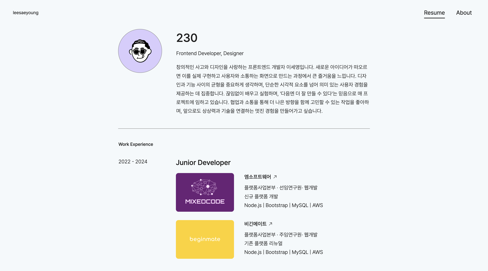

# 🚀 Portpolio

> 상업적 의도가 없는 개인 포트폴리오 웹사이트



## ✨ 주요 기능

- Resume

## 🛠️ 기술 스택

- **Frontend:** `React`, `Node.js`, `CSS`, `JavaScript`

## ⚙️ 설치 방법

프로젝트를 로컬 환경에서 실행하려면 아래 단계를 따르세요.

**1. 사전 요구사항**

- Node.js 16 이상

**2. 설치 과정**

```bash
# 1. 저장소 복제
git clone [https://github.com/twothreezero/portpolio-default.git](https://github.com/twothreezero/portpolio-default)
cd your-project

# 2. 프론트엔드 설정
npm install
```

## 🕹️ 사용법

프로젝트를 설치한 후, 아래 명령어를 실행하여 서버를 시작할 수 있습니다.

```bash
# 프론트엔드 개발 서버 실행
npm start
```

이후 브라우저에서 http://localhost:3000으로 접속하세요.

## 📧 연락처

[twothreezero]

GitHub: @realtwothreezero

Email: realtwothreezero@gmail.com
